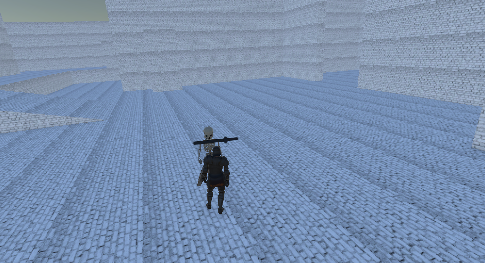

# Unity NavMesh Survival

A Unity prototype featuring AI navigation, enemy tracking, and combat mechanics using Unity NavMesh.

---

## Preview

---

## Features

- Unity NavMesh AI
- Enemy Follow System
- Pathfinding
- Melee Combat Prototype
- Health System
- Basic Survival Mechanics

---

## Built With

- Unity 2022 LTS
- C#
- Unity NavMesh

---

## Purpose

This project was developed to explore Unity's NavMesh system and implement intelligent enemy navigation and combat behaviors.

---

## Author

**Emine Yaman**

Game Developer & UI/UX Designer
